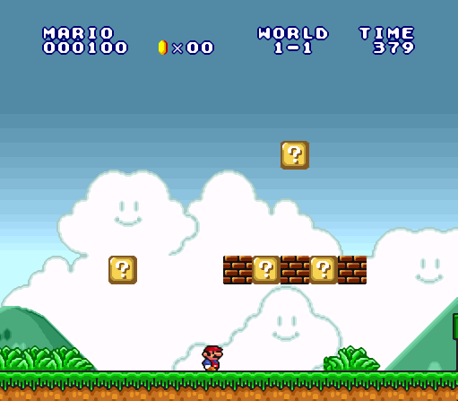
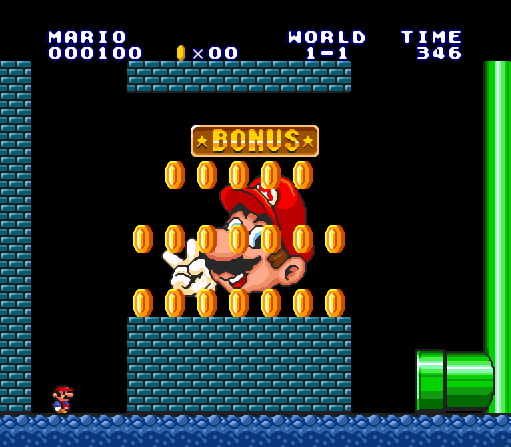
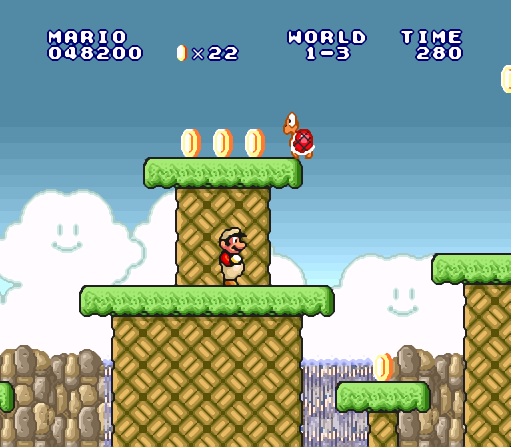
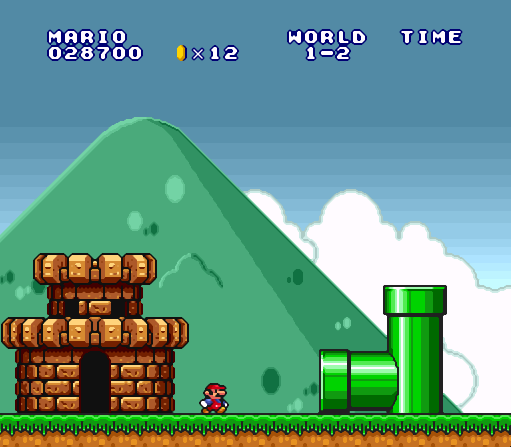
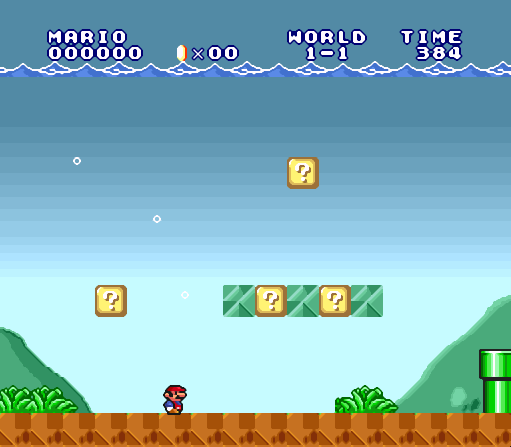

# Super Mario All-Stars: Super Mario Bros. 1 Level Data

This is a comprehensive guide for understanding the Super Mario All-Stars (SMAS) Super Mario Bros. 1 (SMB1) level data.

## Table of Contents

- [Introduction and Terminology](#introduction-and-terminology)
- [Getting area number](#getting-area-number)
- [Area number determined by current world and level](#area-number-determined-by-current-world-and-level)
  - [Table index from current world](#table-index-from-current-world)
  - [Indexing by level](#indexing-by-level)
  - [Special cases of getting area number](#special-cases-of-getting-area-number)
- [Area data from area number](#area-data-from-area-number)
  - [Area palette and area index](#area-palette-and-area-index)
  - [Area sprite data pointers](#area-sprite-data-pointers)
  - [Area object data pointers](#area-object-data-pointers)
  - [Layer 2 background number](#layer-2-background-number)
- [Area sprite data format](#area-sprite-data-format)
  - [Two-byte sprite commands](#two-byte-sprite-commands)
  - [Area pointers](#area-pointers)
- [Area object data-format](#area-object-data-format)
- [Area header data format](#area-header-data-format)
- [Area object commands and subcommands](#area-object-commands-and-subcommands)
  - [Standard object commands](#standard-object-commands)
    - [Standard static object](#standard-static-object)
    - [Extendable objects](#extendable-objects)
    - [Pipe subcommand](#pipe-subcommand)
  - [Miscellaneous object command C](#miscellaneous-object-command-c)
  - [Miscellaneous object command D](#miscellaneous-object-command-d)
  - [Miscellaneous object command E](#miscellaneous-object-command-e)
  - [Miscellaneous object command F](#miscellaneous-object-command-f)

## Introduction and Terminology

Super Mario Bros. 1 was released for the Nintendo Entertainment System (NES) in Japan and North America in the year 1985, and in Europe and Australia two years later. Super Mario All-Stars was a compilation game featuring the four NES Super Mario Bros. Titles (1, 2 (Japan), 2 (USA), and 3) released in 1993 for the Super NES (SNES).

In SMB1, there are eight worlds, and each world has four levels. A screen of the first level of SMAS SMB1 (referred to simply as SMB1 from now on), known as W1-1 (world 1, level 1), is shown below

###### Figure 1: W1-1 main area

Part of W1-1 is an underground bonus area accessed early in the level by entering a pipe.

###### Figure 2: W1-1 bonus area

These are part of the same level, but are considered different _areas_.

Two different levels can also have the same _areas_, as demonstrated by W1-3 and W5-3

###### Figure 3: Two levels using the same area data

An **area** is defined as one of the individual sections of a level as just previously described. Areas can also be called **maps** or **rooms**. However, _map_ can be misintepreted as an SNES map16 tile, and _room_ is a misnomer because several areas are outside. Areas are distinct from **levels** in that levels can have multiple areas (the main area, a bonus area, or a miscellaneous area). A **world** is defined as every level until a Bowser is encountered. Internally, the game increments the player to the next world after the player steps on the bridge-destroying Axe in a Bowser's castles.

- **Note**: Because many levels can have different areas, it is proper to say "the main area of W*X*-*Y*" and "the bonus area of W*X*-*Y*". However, since every level is guaranteed to have a main area accessed simply by starting the level, it will be referred to as just "W*X*-*Y*".

## Getting area number

Every area is defined by a single byte, the **area number**. The area number in [Figure 1](#figure-1-w1-1-main-area) is 0x25. The area number in [Figure 2](#figure-2-w1-1-bonus-area) is 0x42. And the area numbers in [Figure 3](#figure-3-two-levels-using-the-same-area-data) are both 0x26.

There are two ways the game engine determines which area number to use next:

**Current world and level number**: By starting the game or beating a level, the internal world and level number are appropriately set and these determine which area number to use next.

**Enter a new area**: By entering a pipe or climbing a vine, you exit the current area. Using a sprite command (discussed later), the game knows which area number to use next.

## Area number determined by current world and level

There are several constants, addresses, and byte tables that determine the area number when given the world and level numbers.

**$04:C00B**: Full ASM routine for getting area number from world and level numbers.

**$7E:0750**: Stores the current area number. The range goes from 0x00-0x7F; the highest bit is ignored. The highest bit can be set if the area number is loaded by a sprite command (covered later)

**$7E:075C**: A flag that sets the game's **hard mode**. This flag changes sprite properties starting at W5-3 in the original game. Refer to [Figure 3](#figure-3-two-levels-using-the-same-area-data) where W5-3 has the bullet bill generator sprite, but W1-3 does not.

**$7E:075F**: Stores the current world number as a zero-based value.

**$7E:0760**: Stores the current level number as a zero-based value.

**$7E:005C**: Stores the **area type**. This is a 2-bit value determined by bits 5 and 6 of the area number.

Value | Area type
--- | ---
0 | Underwater
1 | Normal ground
2 | Underground
3 | Castle

### Table index from current world
  
**$04:C026**: Max world number, 8. When the player reaches or exceeds this value, the game state is set back to W1-1.

**$04:C11C**: An offset table that determines the position to start at in table $04:C124. The determining factor is the current world number (called at $04:C034).

World | Offset | Implied levels per world
---- | ---- | ----
1 | 0x00 | 5
2 | 0x05 | 5
3 | 0x0A | 4
4 | 0x0E | 5
5 | 0x13 | 4
6 | 0x17 | 4
7 | 0x1B | 5
8 | 0x20 | 4

Some worlds show 5 levels per world. This is caused by a **preview level**. This is the autowalk area that occurs at the start of W1-2, W2-2, W4-2, and W7-2 (area 0x29 for all of them).
      
###### Figure 4: autowalk preview level

      
When the player enters the pipe in this area, the iternal level number is incremented (even though it is not visible in-game). The reasoning behind this being that if the player dies, they are not sent back to the preview level.
  
### Indexing by level
    
**$04:C124**: Table of area numbers (called at $04:C03C). The world start index determined by table $04:C11C is added to the current level number, and this indexes the table to get the current area number.
  
World | Table Offset | Area Number per level
---- | ---- | ----
1 | 00 | 25 29 C0 26 60
2 | 05 | 28 29 01 27 62
3 | 0A | 24 35 20 63
4 | 0E | 22 29 41 2C 61
5 | 13 | 2A 31 26 62
6 | 17 | 2E 23 2D 60
7 | 1B | 33 29 01 27 64
8 | 20 | 30 32 21 65

For example, W4-3 goes 0x0E bytes down this table according to table $04:C11C (starts at the fourth row of this table). W4-3 is actually this world's _fourth_ level because of the W4-2 preview level, so the area number for W4-3 is 0x2C.

### Special cases of getting area number

This method for getting the area number can lead to consequences that the original game may not have considered. For example, if there were an axe in W1-1 and the player used that to beat the level, the game would start the player at W2-1, not W1-2.

Conversely, if there were a flag pole in W1-4 and the player used that to beat the level, the player would be taken to W1-5, not W2-1. Using table $04:C124, the area for W1-5 would be 0x28. This is still W2-1, but under a different name.
  
However, if the player made it to W1-8 (W2-4 under normal condtions) and beat the level by axe, the game would increment the world number and reset the level number. So the player is taken back to W2-1 and will have to repeat the world. [Acmlm's Strange Mario Bros.](https://youtu.be/CkOTA15jFic?t=204) uses this oddity a lot.
    
## Area data from area number

The area number uniquely determines the area data to load. The **area object data** (or **object data**) is a string of bytes that determines how to place objects in the area. Until covered later, **objects** are vaguely defined as things such as question blocks, bricks, spring boards, pipes, etc. This definition is weak because it does not comprehensively cover everything that is an object. There are cases like page skips, scenery changes, pipe pointers, loop commands, and warp zone specifiers which can either be object data or sprite data. A comprehensive dissection of area data vs sprite data is given later in this document.

**Area sprite data** (or **sprite data**) is the string of bytes determining how to place sprites in the area, and **sprites** are temporarily defined as enemies or moving objects such as Goombas, Koopas, Lakitus, etc. **Area data** is the collection of object data and sprite data.

**$04:C041**: The complete ASM routine for getting the area data.

### Area palette and area index

**$7E:00BA**: Stores the NES-style palette and music data of the area. This variable always has the same value as $7E:005C, the area type.

Value | Description
--- | ---
0 | Light blue background with underwater music
1 | Light blue background with above ground music
2 | Black background with underground music
3 | Black background with castle music

**$7E:074F**: Stores the **area index**. This is determined by the lower five bits of $7E:0750, the area _number_. Area _number_ is a single byte which stores the separate entities area _type_ and area _index_.

### Area sprite data pointers

In routine $04:C041, sprite data pointers are loaded first.

**$04:C148**: An offset table that determines the position to start at in table $04:C14C and table $04:C16E. The determining factor is the current area type (called at $04:C05A).

Index | Area Type | Table Offset
--- | --- | ---
0 | Underwater | 0x1F
1 | Above ground | 0x06
2 | Underground | 0x1C
3 | Castle | 0x00

**$7E:00FD**: A three byte pointer to the current area's sprite data.

**$04:C14C**: A table of the low bytes of the current area's pointer to its sprite data (called at $04:C062). The start position is first determined by table $04:C148, then the table is indexed further by the area index.

Area Type | Table Offset | Table Values
--- | --- | ---
Castle | 0x00 | D8 FF 18 47 72 87
Above Ground | 0x06 | C1 E6 03 11 38 69 87 A4 B9 E3 E4 08 11 36 59 62 63 9D C8 F6 12 1B
Underground | 0x1C | 40 6D 9B
Underwater | 0x1F | C8 D9 03

**$04:C16E**: A table of the high bytes of the current area's pointer to its sprite data (called at $04:C06C). The start position is first determined by table $04:C148, then the table is indexed further by the area index.

Area Type | Table Offset | Table Values
--- | --- | ---
Castle | 0x00 | C1 C1 C2 C2 C2 C2
Above Ground | 0x06 | C2 C2 C3 C3 C3 C3 C3 C3 C3 C3 C3 C4 C4 C4 C4 C4 C4 C4 C4 C4 C5 C5
Underground | 0x1C | C5 C5 C5
Underwater | 0x1F | C5 C5 C6

**$04:C06C**: Hardcodes the bank byte of the area sprite data pointer to 0x04.

According to table $04:C124, the area number of W1-1 is 0x25. The area type is therefore _above ground_ and the area index is 0x05. The table's start positions for the sprite data pointer's high and low bytes are both 0x06 according to table $04:C148. Therefore, the sprite data pointer for W1-1 is $04:C369.

### Area object data pointers

**$04:C190**: An offset table that determines the position to start at in table $04:C194 and table $04:C1B6. The determining factor is the current area type (called at $04:C072).

Area Type | Table Offset | Table Values
--- | --- | ---
0 | Underwater | 0x00
1 | Above ground | 0x03
2 | Underground | 0x19
3 | Castle | 0x1C

**$7E:00FA**: A three byte pointer to the current area's object data.

**$04:C194**: A table of the low bytes of the current area's pointer to its object data (called at $04:C092). The start position is first determined by table $04:C148, then the table is indexed further by the area index.

Area Type | Table Offset | Table Values
--- | --- | ---
Underwater | 0x00 | 08 71 0D
Above Ground | 0x03 | 0B 74 C3 1B B0 2F 9A F1 7A E7 F1 35 4A BB 28 A3 D5 6D EB 6B CA F5
Underground | 0x19 | 2D D2 76
Castle | 0x1C | 17 D2 FA D8 D4 01

**$04:C1B6**: A table of the low bytes of the current area's pointer to its object data (called at $04:C097). The start position is first determined by table $04:C148, then the table is indexed further by the area index.

Area Type | Table Offset | Table Values
--- | --- | ---
Underwater | 0x00 | D6 D6 D7
Above Ground | 0x03 | CC CC CC CD CD CE CE CE CF CF CF D0 D0 D0 D1 D1 D1 D2 D2 D3 D3 D3
Underground | 0x19 | D4 D4 D5
Castle | 0x1C | C6 C6 C7 C8 C9 CB

**$04:C09C**: Hardcodes the bank byte of the area object data pointer to 0x04.

For example, the area object data pointer for W1-1 is $04:CE2F.

It is possible for the area number to give an area index that is out of bounds for the given area type. If there were an area 0x08, it would have area type _underwater_ and area index 0x08. This index would exceed the three byte size of the underwater table and move into the above ground table, five bytes down. It would therefore have the same object data pointer as W1-1, resulting in an underwater version of that area.

###### Figure 5: Loading area number 0x08

The sprite data would be undefined, as it exceeds the sprite data pointer's tables' total sizes.

### Layer 2 background number

**$7E:00DB**: Stores the area's **layer 2 background number**. This value corresponds to the area's object data pointer's table index, starting from its base.

Value | Area number | Appears in | Layer 2 background
--- | --- | --- | ---
0x00 | 0x00 | Underwater bonus area | Underwater
0x01 | 0x01 | W1-2 & W7-2 | Underwater
0x02 | 0x02 | W8-4 underwater area | Underwater
0x03 | 0x20 | W3-3 | Night sky w/o mountains
0x04 | 0x21 | W8-3 | Outside castle
0x05 | 0x22 | W4-1 | Mountains and trees
0x06 | 0x23 | W6-2 | Night sky w/ mountains
0x07 | 0x24 | W3-1 | Night sky w/ mountains and snow 
0x08 | 0x25 | W1-1 | Mountains
0x09 | 0x26 | W1-3 & W5-3 | Waterfall
0x0A | 0x27 | W2-3 & W7-3 | Goomba statues/pillars
0x0B | 0x28 | W2-1 | Narrow green hills
0x0C | 0x29 | Preview level | One big mountain
0x0D | 0x2A | W5-1 | Narrow hills w/ snow
0x0E | 0x2B | Sky bonus area | Mario/Luigi bonus area (day)
0x0F | 0x2C | W4-3 | Mushrooms
0x10 | 0x2D | W6-3 | Night sky w/o mountains
0x11 | 0x2E | W6-1 | Night sky w/ mountains
0x12 | 0x2F | W4-2 Warp zone area | Mushrooms
0x13 | 0x30 | W8-1 | Mountains
0x14 | 0x31 | W5-2 | Narrow hills w/ snow
0x15 | 0x32 | W8-2 | Narrow orange hills
0x16 | 0x33 | W7-1 | Narrow hills w/ snow
0x17 | 0x34 | Sky bonus area | Mario/Luigi bonus area (night)
0x18 | 0x35 | W3-2 | Night sky w/ mountains
0x19 | 0x40 | W1-2 | Underground
0x1A | 0x41 | W4-2 | Underground
0x1B | 0x42 | Underground bonus area | Mario/Luigi bonus room
0x1C | 0x60 | W1-4 & W6-4 | Castle
0x1D | 0x61 | W4-4 | Castle w/ pillars and chandeliers
0x1E | 0x62 | W2-4 & W5-4 | Castle w/ pillars
0x1F | 0x63 | W3-4 | Castle w/ pillars
0x20 | 0x64 | W7-4 | Castle w/ pillars and doors
0x21 | 0x65 | W8-4 | Castle w/ windows and thunder/lightning

## Area sprite data format
The game engine iteratively reads **sprite commands** until the terminating sprite command is read. If the first byte of the sprite command is 0xFF, this is the termination sprite command and the read routine is ended. If the low four bits of the first byte of the sprite command are 0x0E, then it is a three-byte area pointer sprite command. Every other case is a two-byte sprite command.

### Two-byte sprite commands

Byte 1 | Byte 2
--- | ---
X X X X Y Y Y Y | P H C C C C C C

**X**: 4 bits determining the X-coordinate of the sprite relative to the current page (in 16 pixel increments).

**Y**: 4 bits determining the Y-coordinate of the sprite relative to the current page (in 16 pixel increments).

**P**: Page flag. If this is set, the sprite is moved to the next page.

**H**: Hard mode flag. The sprite command will only be read if $7E:075C is set.

**C**: Sprite code. Below is a table that comprehensively describes each **area sprite** in SMB1. There exist other sprites like powerups that aren't spawnable by area sprite data.

Code value | Description
--- | ---
0x00 | Green Koopa Troopa (walks off floors)
0x01 | Red Koopa Troopa (walks off floors)
0x02 | Buzzy Beetle
0x03 | Red Koopa Troopa (stays on floors
0x04 | Green Koopa Troopa (walks in place)
0x05 | Hammer Bros.
0x06 | Goomba
0x07 | Blooper/Squid
0x08 | Bullet Bill
0x09 | Yellow Koopa Paratroopa (flies in place)
0x0A | Green cheep-cheep (slow)
0x0B | Red cheep-cheep (fast)
0x0C | Podoboo (jumps up to height specified)
0x0D | Piranha Plant (add 8 pixels to X-coordinate to center around pipes)
0x0E | Green Koopa Paratroopa (Leaping)
0x0F | Red Koopa Paratroopa (Vertical flying)
0x10 | Green Koopa Paratroopa (Horizontal flying)
0x11 | Lakitu
0x12 | Spiny (Not intended for use)
0x13 | Undefined
0x14 | Red Flying cheep-cheeps (generator)
0x15 | Bowser's fire (generator)
0x16 | Fireworks (generator)
0x17 | Bullet Bills/Cheep-cheeps (generator)
0x18-0x1A | Undefined
0x1B | Fire bar (clockwise)
0x1C | Fast fire bar (clockwise)
0x1D | Fire bar (counter-clockwise)
0x1E | Fast fire bar (counter-clockwise)
0x1F | Long fire bar (clockwise)
0x20-0x23 | Undefined
0x24 | Lift for balance ropes
0x25 | Lift (moves down then back up)
0x26 | Lift (moves up)
0x27 | Lift (moves down)
0x28 | Lift (moves left then back right)
0x29 | Lift (falls)
0x2A | Lift (moves right)
0x2B | Short lift (moves up)
0x2C | Short lift (moved down)
0x2D | Bowser
0x2E-0x33 | Undefined
0x34 | Warp zone command
0x35 | Toad or princess (depends on world)
0x36 | Undefined
0x37 | 2 Goombas separated horizontally by 8 pixels (Y = 10)
0x38 | 3 Goombas separated horizontally by 8 pixels (Y = 10)
0x39 | 2 Goombas separated horizontally by 8 pixels (Y = 6)
0x3A | 3 Goombas separated horizontally by 8 pixels (Y = 6)
0x3B | 2 Green Koopa Troopas separated horizontally by 8 pixels (Y = 10)
0x3C | 3 Green Koopa Troopas separated horizontally by 8 pixels (Y = 10)
0x3D | 2 Green Koopa Troopas separated horizontally by 8 pixels (Y = 6)
0x3E | 3 Green Koopa Troopas separated horizontally by 8 pixels (Y = 6)
0x3F | Undefined

### Area pointers
Area pointers are special sprite commands that actually use three bytes to describe them instead of two. The game engine knows the sprite will be a 3 byte area pointer if the lower 4 bits of the first byte are 0x0E.

Byte 1 | Byte 2 | Byte 3
--- | --- | ---
X X X X 1 1 1 0 | P A A A A A A A | W W W S S S S S

**X**: 4 bits determining the X-coordinate of the sprite relative to the current page (in 16 pixel increments).

**P**: Page flag. If this is set, the command is moved to the next page.

**A**: Area number. This is why the area number in general only goes from 0x00-0x7F. Otherwise if the page flag were set, it would result in a different area number.

**W**: The area pointer is only read if the current world $7E:0760 is equal to or greater than this value.

**S**: Determines which screen/page to start the player on when entering the new area.

## Area object data format

The first two bytes of the area object data define the area's header. Once the header has been read, the remaining string of bytes is the area's formatted object data.

## Area header data format
The header data is formatted using the first two bytes of the area object data.

Byte 1 | Byte 2
--- | ---
T T Y Y Y B B B | S S P P F F F F

**T**: Determines the start time of the level.

Value | Start time
--- | ---
0 | Not Set
1 | 400
2 | 300
3 | 200

_Not Set_ start times are chosen for bonus areas and preview levels.

**Y**: Player's starting Y position when entering the area. The X-position is always 24-pixels (X = 1.5) to the right of the page.

Value | Y-Position
--- | ---
0x00 | Y = -1
0x01 | Y = -1 entering from another area
0x02 | Y = 10
0x03 | Y = 4
0x04 | Y = -1
0x05 | Y = -1
0x06 | Y = 10 (autowalk)
0x07 | Y = 10 (autowalk)

**B**: The NES-style layer 1 background. Most of these did not carry over to the SNES

Value | Layer 1 background
--- | ---
0x00 | Nothing
0x01 | Underwater tileset
0x02 | W8-3 wall (unused)
0x03 | Ground above water/lava
0x04 | Night (unused)
0x05 | Snow (unused)
0x06 | Night and snow (unused)
0x07 | Castle palette (unused)

**S**: Layer 1 foreground scenery

Value | Layer 1 foreground scenery
--- | ---
0x00 | None
0x01 | Clouds
0x02 | Mountains
0x03 | Fence

**P**: Platform type

Value | Platform type
--- | ---
0x00 | Green tree platforms
0x01 | Orange mushroom platforms
0x02 | Bullet bill shooters (vertical)
0x03 | Cloud platforms

**F**: Floor fill pattern

Value | Floor fill pattern
--- | ---
0x00 | None
0x01 | 2 block floor
0x02 | 2 block floor and 1 block ceiling
0x03 | 2 block floor and 3 block ceiling
0x04 | 2 block floor and 4 block ceiling
0x05 | 2 block floor and 8 block ceiling
0x06 | 5 block floor and 1 block ceiling
0x07 | 5 block floor and 3 block ceiling
0x08 | 5 block floor and 4 block ceiling
0x09 | 6 block floor and 1 block ceiling
0x0A | 1 block ceiling
0x0B | 6 block floor and 4 block ceiling
0x0C | 9 block floor and 1 block ceiling
0x0D | 2 block floor, 3 block gap, 5 block layer, 2 block gap, 1 block ceiling
0x0E | 2 block floor, 3 block gap, 4 block layer, 3 block gap, 1 block ceiling
0x0F | Filled

## Area object commands and subcommands

The game engine iteratively reads **object commands** until the terminating object command is read. If the first byte of the object command is 0xFD, this is the termination object command and the read routine is ended. If the low four bits of the first byte of the object command are 0x0C, 0x0D, 0x0E, or 0x0F, then it is termed a **miscellaneous object command *X*** where 0x0*X* is the bit result. Everything else is a **standard object command**. Misc. object commands 0x0F are three-byte object commands. Everything else is a two-byte object command.

### Standard object commands

Byte 1 | Byte 2
--- | ---
X X X X Y Y Y Y | P S S S V V V V

**X**: 4 bits determining the X-coordinate of the object relative to the current page (in 16 pixel increments).

**Y**: 4 bits determining the Y-coordinate of the object relative to the current page (in 16 pixel increments).

**P**: Page flag. If this is set, the object is moved to the next page.

**S**: Subcommand

Value | Description
--- | ---
0 | Standard static object
1 | Extendable platform
2 | Row of bricks
3 | Row of blocks
4 | Row of coins
5 | Column of bricks
6 | Column of blocks
7 | Pipe subcommand

#### Standard static object

An object with a predefined size. The object itself is determined by the _V_ bits.

V bits | standard static object value
--- | ---
0x00 | Question block (powerup)
0x01 | Question block (coin)
0x02 | Hidden block (coin)
0x03 | Hidden block (1UP mushroom)
0x04 | Brick (powerup)
0x05 | Brick (growing beanstalk)
0x06 | Brick (star)
0x07 | Brick (multiple coins)
0x08 | Brick (1UP mushroom)
0x09 | Sideways pipe
0x0A | Used question block
0x0B | Trampoline (spawns sprite too)
0x0C | Reverse L pipe
0x0D | Flag pole
0x0E | Bowser's bridge
0x0F | Nothing

#### Extendable objects

**Extendable platform**: The exact platform is specified by the _P_ bits of the area's level header. Depending on the platform type, it is either a horizontal row or a vertical column.

**Horizontal objects**: A horizontally extendable object expands rightward, creating a row of 1 to 16 blocks wide. The size is determined by the _V_ bits.

**Vertical objects**: A vertically extendable object expands downward, creating a column of 1 to 16 blocks high. The size is determined by the _V_ bits.

#### Pipe Subcommand

The pipe subcommand bits are further broken down as E H H H. If _E_ is set, then the pipe is enterable. Otherwise, it is not. _H_ specifies the height of the pipe, moving downward. The width of the pipe is 2 blocks.

### Miscellaneous object command C

These objects are miscellaneous horizontally extendable objects with fixed Y position and fixed height.

Byte 1 | Byte 2
--- | ---
X X X X 1 1 0 0 | P S S S H H H H

**X**: 4 bits determining the X-coordinate of the object relative to the current page (in 16 pixel increments).

**P**: Page flag. If this is set, the object is moved to the next page.

**H**: The horizontal extension of the object.

**S**: The subcommand that defines which object type to place in the area.

_S_ bits | Description
--- | ---
0 | Hole (covers region with blank tiles)
1 | Horizontal rope for pulley lifts
2 | Bridge (Y = 7)
3 | Bridge (Y = 8)
4 | Bridge (Y = 10)
5 | Hole with water/lava
6 | Horizontal question coin blocks (Y = 3)
7 | Horizontal question coin blocks (Y = 7)

### Miscellaneous object command D

This command can either be a page setter or static object. 

Byte 1 | Byte 2
--- | ---
X X X X 1 1 0 1 | P S V V V V V V

**X**: 4 bits determining the X-coordinate of the object relative to the current page (in 16 pixel increments).

**P**: Page flag. If this is set, the object is moved to the next page.

**S**: If this bit is set, then the object is a page setter. The object page is set to the value of the _V_ bits (0x00-0x1F). If the values exceeds 0x1F, the fifth bit is ignored.

If _S_ is not set, then the static object depends on the _V_ bits.

Value | Description
--- | ---
0x00 | Reverse L pipe
0x01 | Flag pole
0x02 | Bowser's axe
0x03 | Rope for axe
0x04 | Bowser's bridge
0x05 | Scroll stop for warp zone
0x06 | Scroll stop
0x07 | Scroll stop
0x08 | Flying red cheep cheep generator
0x09 | Bullet/swimming cheep cheep generator
0x0A | Stop generator
0x0B | Area loop command (e.g. W4-4 looping area)

Values not in the above table cause undefined bahavior.

### Miscellaneous object command E

This command can either be an area header modifier, or a layer 1 background modifier

Byte 1 | Byte 2
--- | ---
X X X X 1 1 1 0 | P 0 S S F F F F

**X**: 4 bits determining the X-coordinate of the object relative to the current page (in 16 pixel increments).

**P**: Page flag. If this is set, the object is moved to the next page.

**S**: Has the same meaning as the _S_ bits in the [header](#area-header-data-format)

**F**: Has the same meaning as the _F_ bits in the [header](#area-header-data-format)

The command could instead be

Byte 1 | Byte 2
--- | ---
X X X X 1 1 1 0 | P 1 ? ? ? B B B

**?**: Invariant. The value of this bit is not considered.

**B**: Has the same meaning as the _B_ bits in the [header](#area-header-data-format)

### Miscellaneous object command F

These objects are formatted with three bytes. They extend past the classic NES 2-byte format to support several SNES-specific tiles (mostly found in castle areas).

Byte 1 | Byte 2 | Byte 3
--- | --- | ---
X X X X 1 1 1 1 | Y Y Y Y L L L L | P S S S S S S S

**X**: 4 bits determining the X-coordinate of the object relative to the current page (in 16 pixel increments).

**Y**: 4 bits determining the Y-coordinate of the object relative to the current page (in 16 pixel increments). Not all subcommands support Y coordinates. 

**P**: Page flag. If this is set, the object is moved to the next page.

**S**: Object subcommand.

Subcommand | Description
--- | ---
0x00 | Vertical rope for lift
0x10 | Vertical rope for pulley lift
0x20 | End-of-level castle
0x28 | Vertically extendable square castle ceiling tiles (caps ceiling edges)
0x30 | End-of-level ascending block stairs
0x32 | Descending steps at beginning of castle areas
0x34 | Rectangular ceiling tiles in castles
0x36 | Right edge for castle floor (recommend L = 0)
0x38 | Left edge for castle floor (recommend L = 0)
0x3A | Bottom left inverted corner for castle floor (recommend L = 1)
0x3C | Bottom right inverted corner for catle floor (L > 0 renders castle floor too)
0x3E | Vertical sea blocks for underwater areas
0x40 | Entedable reverse L pipe
0x50 | Vertical balls/rope/vin for climbing
0x60 | Nothing
0x70 | Nothing

The Y-coordinate is disregarded for Subcommands whose low four bits are zero. Subcommands not included in the table cause undefined behavior.
