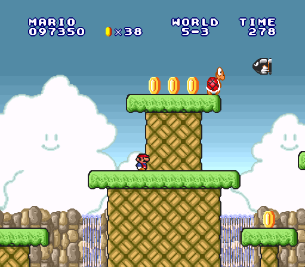

# Super Mario All-Stars: Super Mario Bros. 1 Level Data
This is a comprehensive guide for understanding the Super Mario All-Stars (SMAS) Super Mario Bros. 1 (SMB1) level data.

## Table of Contents
- [Introduction and Terminology](#introduction-and-terminology)
- [Getting area number](#getting-area-number)
- [Area number determined by current world and level](#area-number-determined-by-current-world-and-level)
  - [Indexing by world](#indexing-by-world)
  - [Indexing by level](#indexing-by-level)
  - [Special cases of getting area number](#special-cases-of-getting-area-number)
- [Area data from area number](#area-data-from-area-number)
  - [Area palette and area index](#area-palette-and-area-index)
  - [Area sprite data pointers](#area-sprite-data-pointers)
    - [Indexing by area type](#indexing-by-area-type)
    - [Indexing by area type and area index](#indexing-by-area-type-and-area-index)
  - [Area object data pointers](#area-object-data-pointers)
    - [Indexing by area type](#indexing-by-area-type-1)
    - [Indexing by area type and area index](#indexing-by-area-type-and-area-index-1)
  - [Layer 2 background index](#layer-2-background-index)
- [Area data format](#area-data-format)
  - [Area sprite data](#area-sprite-data)
    - [Area pointers](#area-pointers)
  - [Area object data](#area-object-data)

## Introduction and Terminology
Super Mario Bros. 1 was released for the Nintendo Entertainment System (NES) in Japan and North America in the year 1985, and in Europe and Australia two years later. Super Mario All-Stars was compilation game featuring the four NES Super Mario Bros. Titles (1, 2 (Japan), 2 (USA), and 3) released in 1993 for the Super NES (SNES). There are eight worlds, and each world has four levels. A screen of the first level of SMAS SMB1 (referred to simply as SMB1 from now on), known as W1-1 (world 1, level 1), is shown below

###### Figure 1: W1-1 example

Part of W1-1 is an underground bonus area accessed early in the level by entering a pipe.

###### Figure 2: W1-1 bonus area

These are part of the same level, but are considered different "areas".

More interestingly, we have W1-3 and W5-3.

These, conversely, are different levels but the same "areas".

We will define **area** as how it was described above. Areas can also be called **maps** or **rooms**. For our purpose, we will stick to _area_. Areas are distinct from **levels** in that levels can have multiple areas (the main area, a bonus area, or a miscellaneous area). A **world** is defined as every level until a Bowser is encountered. Internally, the game increments you to the next world after beating a Bowser (more precisely after stepping on his bridge-destroying axe).

- **Note**: For simplicity, when we refer to the main area of the level, we will simply refer to the level. So instead of saying "the main area of W1-1", we'll simply say "W1-1".

Every area is defined by a single byte, used as a pointer index for getting the area data (blocks, pipes, bricks, etc.) and sprite data (enemies, commands, etc.). For the images shown above, the area numbers are 0x25 for W1-1, 0x42 for its bonus room, and 0x26 for both W1-3 and W5-3.

## Getting area number

There are two ways the game engine determines which area number to use next:

**Current world and level number**: By starting the game or beating the level, the internal world and level number are appropriately set and these determine which area number to use.

**Exit the level**: By entering a pipe or climbing a vine, you exit the level. Using a sprite command (discussed later), the game knows which area to load if you exit the level.

We will first discuss how we get the area number. Then we will discuss how get the area data from the area number. Finally, we will document the area data format; we annotate how it is interpreted as a full level.

## Area number determined by current world and level
There are several constants, addresses, and byte tables that determine the area number when given the world and level numbers.

**`$04:C00B`**: Full routine for getting area number from world and level numbers.

**`$7E:0750`**: Stores the current area number. The range goes from `0x00-0x7F`. If it exceeds this, the highest bit is ignored. The highest bit is only set if it has to be set by a sprite command (more on this later).

**`$7E:075C`**: "Hard mode" flag. This flag changes sprite properties starting at W5-3 (e.g. bullet bills in W5-3 but not W1-3, fire bars in W6-4 but not W1-4, shorter moving platforms, etc.)

**`$7E:075F`**: Stores the current world number as a zero-based value (W1 is `00`, W2 is `01`, etc.)

**`$7E:0760`**: Stores the current level number as a zero-based value (W1-1 is `00`, W8-2 is `01`, etc.)

**`$7E:005C`**: Stores the area "type". This is a 2-bit value determined by bits 5 and 6 of the area number.

Bits | Value | Area type
---- | ----- | ---
00 | 0 | Underwater
01 | 1 | Normal ground
10 | 2 | Underground
11 | 3 | Castle

### Indexing by world
  
**`$04:C026`**: Max world number, `08`. When the player exceeds this, the game state is set back to W1-1.

**`$04:C11C`**: An index table that determines the start index for the "area number table per level". This table is indexed by world number (called at `$04:C034`).

World | Offset | Levels per world
---- | ---- | ----
1 | `00` | 5
2 | `05` | 5
3 | `0A` | 4
4 | `0E` | 5
5 | `13` | 4
6 | `17` | 4
7 | `1B` | 5
8 | `20` | 4 (Until Bowser is reached)

- **Note**: Some worlds show 5 levels per world. This is caused by **prelevels**. This is the autowalk preview area that occurs at the start of W1-2, W2-2, W4-2, and W7-2 (area `0x29` for all of them).
      
  
      
  This, while being shown as W1-2 along with the underground area that follows, is actually a separate level. So when the player enters the pipe, the game internally increments the level number (but doesn't display it on the screen). So technically, the underground area is level 3, the green trees area is level 4, and the castle is level 5. But the game still displays the level number we're all used to seeing. The reasoning behind this being that if you die in, say, the underground area of W1-2, you respawn in the underground area, and not the autowalk pipe entrance every time.
  
### Indexing by level
    
**`$04:C124`**: Table of area numbers (called at `$04:C03C`). The world start index determined by table `$04:C11C` is added to the current level number, and this indexes the table to get the current area number.
  
World | Table Offset | Area Number per level
---- | ---- | ----
1 | `00` | `25 29 C0 26 60`
2 | `05` | `28 29 01 27 62`
3 | `0A` | `24 35 20 63`
4 | `0E` | `22 29 41 2C 61`
5 | `13` | `2A 31 26 62`
6 | `17` | `2E 23 2D 60`
7 | `1B` | `33 29 01 27 64`
8 | `20` | `30 32 21 65`

For example, W4-3 would have world offset `0x0E`. We go four values down the list because we add an extra level number for the autowalk sequence of W4-2. Thus, the area number of W4-3 is `0x2C`.

### Special cases of getting area number
  
There are interesting cases that can occur when the player does or doesn't complete a world. For example, if we put an Axe in W1-1 and the player used that to beat the level, the game would start the player at world 2, so our next level loaded would be W2-1, not W1-2.

Even more interestingly, if we put a flag pole in W1-4 and the player used that to beat the level, the level number would increment to level 5, but the world number would still be W1. So the next level we'd go to is W1-5. To determine the area number for this, we'd move 5 bytes off of the area number table starting at index `00` for world 1. This would be area `0x28`. So we'd still be in W2-1, but the game will show us W1-5.
  
Further, if the player made it to W1-8 (W2-4 normally) and beat the level by the axe, we wouldn't be taken to W3-1. The game will increment the world number to W2 and would reset us to level 1. Hence, we'd be taken back to area `0x28` under the standard W2-1. We would have to do this whole world again to get back on track. Acmlm's Strange Mario Bros. uses this oddity a lot.
    
## Area data from area number
Now that we know how to get the area number, we need to get the area data. The **area object data** (or **object data**) is a string of bytes that determines how to place objects in the level. We loosely define **objects** as things such as question blocks, bricks, spring boards, pipes, etc. This definition is weak because it doesn't comprehensively cover everything. There are oddities like page skips, scenery changes, pipe pointers, loop commands, and warp zone specifies, which can either be classified as object data or sprite data. A comprehensive dissection of area data vs sprite data will be given later in this document. But on this same token, we will define **area sprite data** (or **sprite data**) as the string of bytes determining how to place sprites in the level, and we equally give a loose definition of **sprites** as things such Goombas, Koopas, Lakitus, etc. We define **area data** itself as the object data, sprite data, and other area-specific information we will discuss in this section.

**`$04:C041`**: The complete routine for getting the area data.

### Area palette and area index

**`$7E:00BA`**: Stores the NES-style palette and music data of the area.

Value | Description
--- | ---
0 | Light blue background with underwater music
1 | Light blue background with above ground music
2 | Black background with underground music
3 | Black background with castle music

- **Note**: This variable will always have the same value as `$7E:005C`, the area type.

**`$7E:074F`**: Area _index_. This is determined by the lower five bits of `$7E:0750`, the area _number_. The difference can be confusing at first, but will be analyzed shortly.

### Area sprite data pointers

#### Indexing by area type

**`$04:C148`**: Table of relative indices to area sprite data pointer tables (called at `$04:C05A`). This table is indexed by area type. Much like how we used the world number to determine the start offset for getting the area number per level, we're using the area type to get the pointer to the sprite data per area index (an example will be provided afterward to try to clear any confusion).

Index | Area Type | Table Offset
--- | --- | ---
0 | Underwater | `1F`
1 | Above ground | `06`
2 | Underground | `1C`
3 | Castle | `00`

#### Indexing by area type and area index

**`$7E:00FD`**: A three byte pointer to the current area's sprite data.

**`$04:C14C`**: Table of low bytes of area sprite data pointers (called at `$04:C062`).

Area Type | Table Offset | Table Values
--- | --- | ---
Castle | `00` | `D8 FF 18 47 72 87`
Above Ground | `06` | `C1 E6 03 11 38 69 87 A4 B9 E3 E4 08 11 36 59 62 63 9D C8 F6 12 1B`
Underground | `1C` | `40 6D 9B`
Underwater | `1F` | `C8 D9 03`

**`$04:C16E`**: Table of high bytes of area sprite data pointers (called at `$04:C06C`).

Area Type | Table Offset | Table Values
--- | --- | ---
Castle | `00` | `C1 C1 C2 C2 C2 C2`
Above Ground | `06` | `C2 C2 C3 C3 C3 C3 C3 C3 C3 C3 C3 C4 C4 C4 C4 C4 C4 C4 C4 C4 C5 C5`
Underground | `1C` | `C5 C5 C5`
Underwater | `1F` | `C5 C5 C6`

**`$04:C06C`**: Hardcodes the bank byte of the area sprite data pointer to `0x04`.

As an example, we will get the sprite data pointer for the first area of W1-1. It's area number is `0x25`. Its area type is _Above ground_ and its area index is `0x05`. The table offset for _above ground_ is `0x06`, so we move 6 bytes down the low and high byte pointer table (starting us at the second row). Then from the second row, we move 5 bytes down the list. So the low byte of the sprite pointer is `0x38` and the high byte is `0xC3`. The bank byte is always `0x04`, so the sprite data pointer for area 0x25 is `$04:C369`.

### Area object data pointers

#### Indexing by area type

**`$04:C190`**: Table of relative indices to area object data pointer tables (called at `$04:C072`). This table is like table `$04:C148`.

Area Type | Table Offset | Table Values
--- | --- | ---
0 | Underwater | `00`
1 | Above ground | `03`
2 | Underground | `19`
3 | Castle | `1C`

#### Indexing by area type and area index

**`$7E:00FA`**: A three byte pointer to the current area's object data.

**`$04:C194`**: Table of low bytes of area object data pointers (called at `$04:C092`).

Area Type | Table Offset | Table Values
--- | --- | ---
Underwater | `00` | `08 71 0D`
Above Ground | `03` | `0B 74 C3 1B B0 2F 9A F1 7A E7 F1 35 4A BB 28 A3 D5 6D EB 6B CA F5`
Underground | `19` | `2D D2 76`
Castle | `1C` | `17 D2 FA D8 D4 01`

**`$04:C1B6`**: Table of high bytes of area object data pointers (called at `$04:C097`).

Area Type | Table Offset | Table Values
--- | --- | ---
Underwater | `00` | `D6 D6 D7`
Above Ground | `03` | `CC CC CC CD CD CE CE CE CF CF CF D0 D0 D0 D1 D1 D1 D2 D2 D3 D3 D3`
Underground | `19` | `D4 D4 D5`
Castle | `1C` | `C6 C6 C7 C8 C9 CB`

**`$04:C09C`**: Hardcodes the bank byte of the area object data pointer to `0x04`.

So the area object data pointer for area `0x25` is `$04:CE2F`. Another point of interest is that an area index can exceed its bounds. For example, if we had area number `0x08` (not an area in the game), it would have area type _underwater_ and area index `0x08`. So we would go 8 bytes down the pointer tables starting at the underwater offset. For the area object data, this pointer would be `$04:CE2F`. This is the same as area `0x25` (W1-1). So what we would get is an underwater version of this area.

The sprites data however, would be undefined, as it exceeds the table size when starting at the underwater offset.

### Layer 2 background index

**`$7E:00DB`**: Stores the area's layer 2 background. This value is determined by table `$04:C190` and the area index. More precisely, the value that the aforementioned table returns when given the area type is added to the area index, and the result is stored as the layer 2 background.

Value | Area number | Appears in | Layer 2 background
--- | --- | --- | ---
`00` | `00` | Various | Underwater bonus area
`01` | `01` | W1-2 & W7-2 | Underwater
`02` | `02` | W8-4 underwater | Underwater
`03` | `20` | W3-3 | Night sky w/o mountains
`04` | `21` | W8-3 | Outside castle
`05` | `22` | W4-1 | Mountains and trees
`06` | `23` | W6-2 | Night sky w/ mountains
`07` | `24` | W3-1 | Night sky w/ mountains and snow 
`08` | `25` | W1-1 | Mountains
`09` | `26` | W1-3 & W5-3 | Waterfall
`0A` | `27` | W2-3 & W7-3 | Goomba statues/pillars
`0B` | `28` | W2-1 | Narrow green hills
`0C` | `29` | Autowalk | One big mountain
`0D` | `2A` | W5-1 | Narrow hills w/ snow
`0E` | `2B` | Sky bonus area | Mario/Luigi bonus area (day)
`0F` | `2C` | W4-3 | Mushrooms
`10` | `2D` | W6-3 | Night sky w/o mountains
`11` | `2E` | W6-1 | Night sky w/ mountains
`12` | `2F` | W4-2 Warp zone | Mushrooms
`13` | `30` | W8-1 | Mountains
`14` | `31` | W5-2 | Narrow hills w/ snow
`15` | `32` | W8-2 | Narrow orange hills
`16` | `33` | W7-1 | Narrow hills w/ snow
`17` | `34` | Sky bonus area | Mario/Luigi bonus area (night)
`18` | `35` | W3-2 | Night sky w/ mountains
`19` | `40` | W1-2 | Underground
`1A` | `41` | W4-2 | Underground
`1B` | `42` | Underground bonus area | Mario/Luigi bonus room
`1C` | `60` | W1-4 & W6-4 | Castle
`1D` | `61` | W4-4 | Castle w/ pillars and chandeliers
`1E` | `62` | W2-4 & W5-4 | Castle w/ pillars
`1F` | `63` | W3-4 | Castle w/ pillars
`20` | `64` | W7-4 | Castle w/ pillars and doors
`21` | `65` | W8-4 | Castle w/ windows and thunder/lightning

## Area data format
Now that we know how to get the area data, we can finally document how it is formatted

### Area sprite data
We'll start with the sprite data because it is less complicated. Every sprite that is inserted into an area requires two bytes (except area exit pointers; discussed later). Data is continuously loaded into the game until the terminating byte `0xFF` is read for the sprite's first byte. Below is a breakdown of their two byte format.

Byte 1 | Byte 2
--- | ---
`X X X X Y Y Y Y` | `P H E E E E E E`

**X**: 4 bits determining the X-coordinate of the sprite relative to the current page (in 16 pixel increments).

**Y**: 4 bits determining the Y-coordinate of the sprite relative to the current page (in 16 pixel increments).

**P**: Page flag. If this is set, the sprite is moved to the next page.

**H**: Hard mode flag. The sprite will only spawn after W5-3.

**E**: Enemy data

Below is a table that comprehensively describes each **sprite** in SMB1.

E bit value | Sprite Description
--- | ---
`00` | Green Koopa Troopa (walks off floors)
`01` | Red Koopa Troopa (walks off floors)
`02` | Buzzy Beetle
`03` | Red Koopa Troopa (stays on floors
`04` | Green Koopa Troopa (animates, but doesn't move)
`05` | Hammer Bros.
`06` | Goomba
`07` | Blooper/Squid
`08` | Bullet Bill
`09` | Yellow Koopa Paratroopa (animates, but doesn't move)
`0A` | Green cheep-cheep (slow)
`0B` | Red cheep-cheep (fast)
`0C` | Podoboo (jumps up to height specified)
`0D` | Piranha Plant (add 8 pixels to X-coordinate to center around pipes)
`0E` | Green Koopa Paratroopa (Leaping)
`0F` | Red Koopa Paratroopa (Vertical flying)
`10` | Green Koopa Paratroopa (Horizontal flying)
`11` | Lakitu
`12` | Spiny (Not intended for use)
`13` | Undefined
`14` | Red Flying cheep-cheeps (generator)
`15` | Bowser's fire (generator)
`16` | Fireworks (generator)
`17` | Bullet Bills/Cheep-cheeps (generator)
`18-1A` | Undefined
`1B` | Fire bar (clockwise)
`1C` | Fast fire bar (clockwise)
`1D` | Fire bar (counter-clockwise)
`1E` | Fast fire bar (counter-clockwise)
`1F` | Long fire bar (clockwise)
`20-23` | Undefined
`24` | Lift for balance ropes
`25` | Lift (moves down then back up)
`26` | Lift (moves up)
`27` | Lift (moves down)
`28` | Lift (moves left then back right)
`29` | Lift (falls)
`2A` | Lift (moves right)
`2B` | Short lift (moves up)
`2C` | Short lift (moved down)
`2D` | Bowser
`2E-33` | Undefined
`34` | Warp zone command
`35` | Toad or princess (depends on world)
`36` | Undefined
`37` | 2 Goombas separated horizontally by 8 pixels (Y = 10)
`38` | 3 Goombas separated horizontally by 8 pixels (Y= 10)
`39` | 2 Goombas separated horizontally by 8 pixels (Y = 6)
`3A` | 3 Goombas separated horizontally by 8 pixels (Y= 6)
`3B` | 2 Green Koopa Troopas separated horizontally by 8 pixels (Y = 10)
`3C` | 3 Green Koopa Troopas separated horizontally by 8 pixels (Y= 10)
`3D` | 2 Green Koopa Troopas separated horizontally by 8 pixels (Y = 6)
`3E` | 3 Green Koopa Troopas separated horizontally by 8 pixels (Y= 6)
`3F` | Undefined

#### Area pointers
Area pointers are special sprite commands that actually use three bytes to describe them instead of two. The game engine knows the sprite will be a 3 byte area pointer if the Y coordinate it reads is `0x0E`. Below is the format for area pointer sprite commands

Byte 1 | Byte 2 | Byte 3
--- | --- | ---
`X X X X 1 1 1 0` | `P A A A A A A A` | `W W W S S S S S`

**X**: 4 bits determining the X-coordinate of the sprite relative to the current page (in 16 pixel increments).

**P**: Page flag. If this is set, the sprite is moved to the next page.

**A**: Area number. Note that this is why the area number only goes from `0x00-0x7F`. Numbers higher than this can be passed if the page flag is set, but the game engine just ignores that bit.

**W**: Defines which world to start accepting this area pointer. For example if the W bits are 4 (World 5) and the current world is World 1, then this area pointer is ignored

**S**: Determines which screen/page to start the player on when entering the new area.

### Area object data
The first two bytes of the area object data define the area's header. After that, the game engine continues reading object data commands until the value `0xFD` is read at the object data's first byte.
#### Aread header data format
The header data is formatted using the first two bytes of the area object data.

byte 1 | byte 2
--- | ---
`T T Y Y Y B B B` | `S S G G F F F F`
